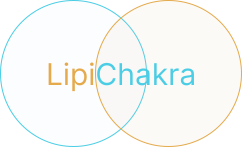

# LipiChakra

A gesture-based keyboard designed for Indic scripts — built around
the linguistic structure of the alphabet instead of the QWERTY layout.

Instead of rows and columns of keys, LipiChakra uses two circular gesture
interfaces: one radial for consonants and one for vowels. Characters are
selected through direction and distance, with context-aware prediction based
on previous input, aiming for fast one-handed typing.

This repository hosts the public landing site and the web-based practice
simulator for the Devanagari circular keyboard. Development of the Android
keyboard is ongoing separately.

## Try it

Open [index.html](index.html) in a browser, or go straight to the
[simulator](playground/sim.html) to practice the gesture interface.

No build step or dependencies — it's plain HTML/CSS/JS, so any static file
server (or just opening the files directly) works.

## Status

LipiChakra is currently an experimental research project. The simulator lets
you try the interaction model while development of the Android keyboard
continues.
